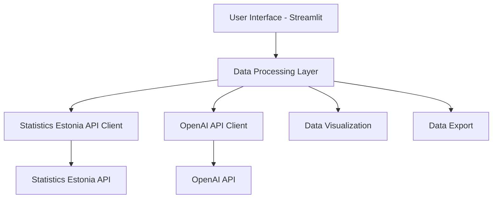
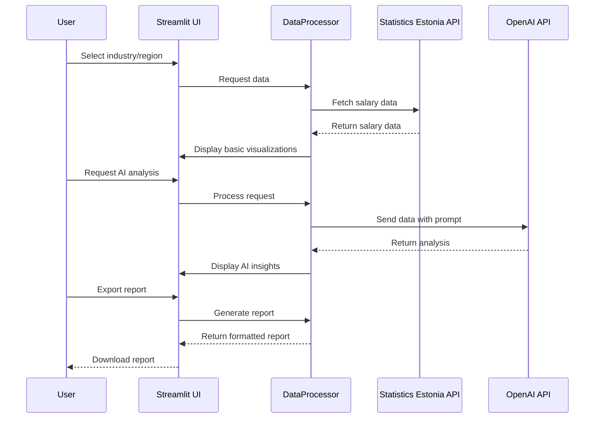

# Estonian Salary Trends Application - Detailed Plan

Based on my exploration of the Statistics Estonia database and the requirements you've provided, I've created a detailed plan for developing the Estonian Salary Trends web application. This plan outlines the architecture, components, data flow, and implementation steps needed to create a comprehensive salary analysis tool.

## 1. Project Overview

**Objective**: Develop a web application that enables users to analyze Estonian salary market data and understand salary trends across various sectors, with AI-generated summaries and forecasts.

**Timeline**: MVP within 1-2 weeks (tight timeline)

**Deployment**: Local deployment for personal or internal team use

## 2. Data Sources

From my exploration of the Statistics Estonia database, I've identified several valuable data tables that can be used for our application:

1. **PA107**: Average monthly gross wages, median wages, and number of employees by county (updated March 2025)
2. **PA51**: Average monthly gross and net wages (2000-2017, monthly data)
3. **PA5321**: Average monthly gross and net wages by county (2000-2017)
4. **PA118**: Average hourly gross wages by county (quarterly data)
5. **PA22**: Average hourly gross wages by county (2000-2018, quarterly data)
6. **PA5322**: Average hourly gross wages by county (2000-2017)
7. **PA5331**: Average monthly gross and net wages by kind of owner of an enterprise (2000-2017)

These tables provide comprehensive data on salaries across different regions, time periods, and sectors in Estonia.

## 3. System Architecture

### Components:

1. **User Interface (Streamlit)**
   - Interactive dashboard with filters and visualizations
   - Chat interface for AI-generated insights
   - Data export functionality

2. **Data Processing Layer**
   - Data fetching and caching
   - Data transformation and analysis
   - Integration between Statistics Estonia and OpenAI APIs

3. **Statistics Estonia API Client**
   - Handles requests to the Statistics Estonia API
   - Parses and formats the response data

4. **OpenAI API Client**
   - Manages communication with the OpenAI API
   - Constructs prompts and processes responses

5. **Data Visualization**
   - Interactive charts and graphs
   - Comparative visualizations
   - Trend analysis displays

6. **Data Export**
   - Export functionality for reports in various formats (CSV, Excel, PDF)

## 4. Data Flow

## 5. Feature Breakdown

### 5.1 Data Selection and Filtering
- Industry sector selection (dropdown)
- Region/county selection (dropdown)
- Time period selection (slider or date range picker)
- Data type selection (average, median, hourly, monthly)

### 5.2 Data Visualization
- Time series charts showing salary trends
- Bar charts comparing salaries across regions/sectors
- Growth rate visualizations
- Comparative analysis (e.g., sector vs. national average)

### 5.3 AI-Powered Analysis (Chat Interface)
- Trend analysis and explanation
- Salary growth forecasting
- Career growth recommendations
- Contextual insights based on economic factors

### 5.4 Export and Reporting
- Download data in various formats (CSV, Excel)
- Generate PDF reports with visualizations and AI insights
- Save and share analysis results

## 6. Technical Implementation

### 6.1 Technology Stack
- **Frontend/Backend**: Python with Streamlit
- **Data Processing**: Pandas, NumPy
- **Visualization**: Plotly, Matplotlib, Altair
- **API Integration**: Requests, OpenAI Python SDK
- **Export**: ReportLab, XlsxWriter

### 6.2 API Integration

#### Statistics Estonia API
- Create a client to access the identified data tables
- Implement caching to reduce API calls
- Handle data transformation and normalization

#### OpenAI API (GPT-4)
- Design effective prompts for salary trend analysis
- Implement context management to provide relevant data to the model
- Create a chat interface for user questions

### 6.3 Data Processing Pipeline
1. Fetch raw data from Statistics Estonia API
2. Clean and transform data into analysis-ready format
3. Calculate additional metrics (growth rates, comparisons)
4. Prepare data for visualization and AI analysis

## 7. Implementation Plan (1-2 Week Timeline)

### Week 1
- **Days 1-2**: Set up project structure and implement Statistics Estonia API client
- **Days 3-4**: Develop data processing pipeline and basic visualizations
- **Days 5-7**: Implement OpenAI API integration and chat interface

### Week 2 (if needed)
- **Days 1-2**: Enhance visualizations and add comparative analysis features
- **Days 3-4**: Implement export functionality and reporting
- **Days 5-7**: Testing, bug fixing, and final polishing

## 8. Potential Challenges and Solutions

### 8.1 API Limitations
- **Challenge**: Statistics Estonia API might have rate limits or complex data structures
- **Solution**: Implement caching and efficient data fetching strategies

### 8.2 Data Freshness
- **Challenge**: Some data tables might not be updated frequently
- **Solution**: Clearly indicate data freshness and implement forecasting for recent periods

### 8.3 OpenAI API Costs
- **Challenge**: Managing costs for OpenAI API usage
- **Solution**: Optimize prompts, cache common responses, and implement usage limits

### 8.4 Performance
- **Challenge**: Processing large datasets might affect application performance
- **Solution**: Implement lazy loading, pagination, and efficient data structures

## 9. Future Enhancements (Post-MVP)

1. User accounts and saved analyses
2. More advanced forecasting models
3. Integration with additional data sources (e.g., job posting sites)
4. Mobile-optimized interface
5. Expanded industry and role-specific insights

## 10. Conclusion

This plan outlines a comprehensive approach to building the Estonian Salary Trends application within the tight 1-2 week timeline. By leveraging Streamlit for rapid development, integrating with the Statistics Estonia API for data, and using the OpenAI API for intelligent insights, we can create a valuable tool for salary analysis and career planning.

The application will provide users with comprehensive data including average salaries, salary ranges, and growth rates by both industry and region, with moderate interactivity through dynamic filtering, comparative charts, and report export functionality. The dedicated chat interface will allow users to ask specific questions about the data and receive customized AI responses.